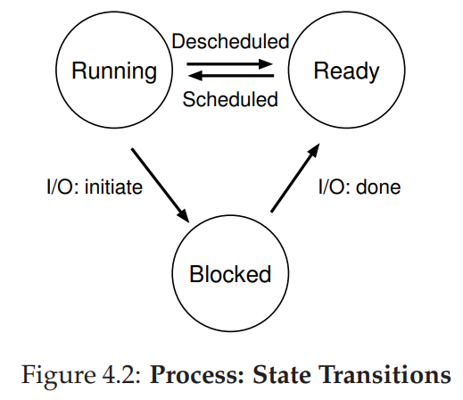

# 04 The Abstraction: The Process

- 进程（Process）：操作系统为正在运行的程序提供的抽象。程序本身是没有生命周期的，它只是存在磁盘上面的一些指令（也可能是一些静态数据）。是操作系统让这些字节运行起来，让程序发挥作用。
- 时分共享（time sharing）CPU：通过让一个进程只运行一个时间片，然后切换到其他进程，操作系统提供了存在多个虚拟 CPU 的假象。

***4.1 The Abstraction: A Process***

- 进程的机器状态
  - 内存
  - 寄存器
  - 栈 / 帧指针
  - 文件列表

***4.2 Process API***

- 创建（create）
- 销毁（destroy）
- 等待（wait）
- 其他控制（miscellaneous control）
- 状态（status）

***4.3 Process Creation: A Little More Detail***

操作系统如何启动并运行一个程序？进程创建实际如何进行？

1. 将代码和所有静态数据（例如初始化变量）以惰性方式加载（load）到内存中，加载到进程的地址空间中；
2. 为程序的运行时栈（run-time stack 或 stack）分配一些内存；
3. 可能为程序的堆（heap）分配一些内存；
4. 将执行一些其他初始化任务，特别是与输入/输出（I/O）相关的任务；
5. 跳转到 main()例程，OS 将 CPU 的控制权转移到新创建的进程中，从而程序开始执行。

***4.4 Process States***

- 运行（running）：在运行状态下，进程正在处理器上运行。这意味着它正在执行
指令。
- 就绪（ready）：在就绪状态下，进程已准备好运行，但由于某种原因，操作系统
选择不在此时运行。
- 阻塞（blocked）：在阻塞状态下，一个进程执行了某种操作，直到发生其他事件
时才会准备运行。

***4.5 Data Structures***

- 使用一些数据结构来跟踪各种相关的信息，如进程状态。

***4.6 Summary***

操作系统最基本的抽象：进程。

---
***The Creux of The Problem***

- **如何提供有许多 CPU 的假象？**

    >虽然只有少量的物理 CPU 可用，但是操作系统如何提供几乎有无数个 CPU 可用的假象？